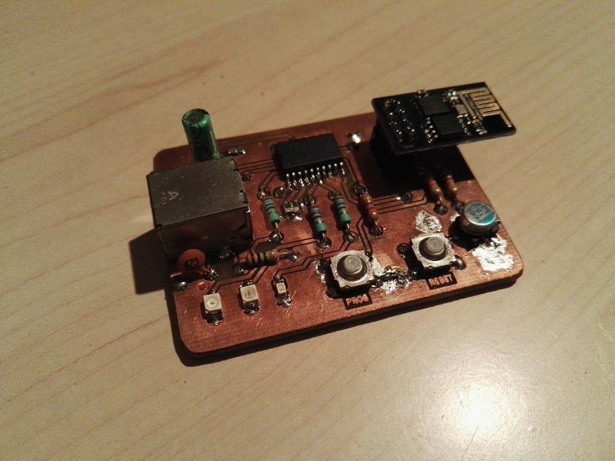

ESP-01 prototyping board
========================

This board allows to discuss an ESP-01 and program it from a USB connected PC.
So it basically embeds a voltage regulator, and a USB/Serial transceiver.
Push buttons allows to switch to bootloader mode.

ESP-01 is the cheapest ESP8266 based iot component, less than 5$
It's only a wifi modem that's driven by [AT commands](https://room-15.github.io/blog/2015/03/26/esp8266-at-command-reference/#AT), no GPIO, no available peripherals.

Typical case is to connect it with an arduino or equivalent discussing AT commands over tx/rx pins.
Flashing a new firmware can be done over tx/rx as well, after a special boot procedure.

